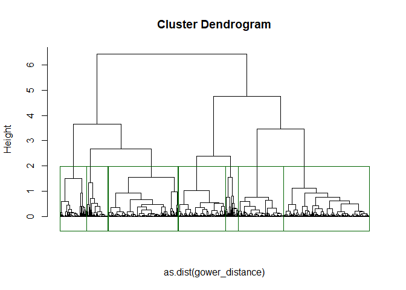

Clustering on Customer Hotel Reservation
================

The objective of this report is to observe behaviour of hotel customers
and compare two clustering methods on this dataset( k-medoids/
hierarchical). The dataset refers to a random sample of room
reservations at a hotel and whether or not the reservation was
ultimately cancelled.

### Dataset Variables

| Variable | Description |
|----|----|
| `Booking_ID` | Unique identifier for each booking |
| `number.of.adults` | Number of adults included in the booking |
| `number.of.children` | Number of children included in the booking |
| `number.of.weekend.nights` | Number of weekend nights included in the booking |
| `number.of.week.nights` | Number of week nights included in the booking |
| `type.of.meal` | Type of meal included in the booking |
| `car.parking.space` | Indicates whether a car parking space was requested or included in the booking |
| `room.type` | Type of room booked |
| `lead.time` | Number of days between the booking date and the arrival date |
| `market.segment.type` | Type of market segment associated with the booking |
| `repeated` | Indicates whether the booking is a repeat booking |
| `P.C` | Number of previous bookings canceled by the customer prior to the current booking |
| `P.not.C` | Number of previous bookings not canceled by the customer prior to the current booking |
| `average.price` | Average price associated with the booking |
| `special.requests` | Number of special requests made by the guest |
| `date.of.reservation` | Date of the reservation |
| `booking.status` | Status of the booking (canceled or not canceled) |

#### Dataset : First 10 observations

| Booking_ID | number.of.adults | number.of.children | number.of.weekend.nights | number.of.week.nights | type.of.meal | car.parking.space | room.type | lead.time | market.segment.type | repeated | P.C | P.not.C | average.price | special.requests | date.of.reservation | booking.status |
|:---|---:|---:|---:|---:|:---|---:|:---|---:|:---|---:|---:|---:|:---|---:|:---|:---|
| BID19169 | 2 | 0 | 1 | 0 | Meal Plan 1 | 0 | Room_Type 1 | 0 | Online | 0 | 0 | 0 | 115 | 1 | 43016 | Not_Canceled |
| BID26830 | 2 | 0 | 1 | 4 | Meal Plan 1 | 0 | Room_Type 1 | 11 | Online | 0 | 0 | 0 | 90 | 2 | 8/17/2017 | Canceled |
| BID00278 | 1 | 0 | 2 | 1 | Meal Plan 1 | 0 | Room_Type 1 | 33 | Online | 0 | 0 | 0 | 82.9 | 2 | 43223 | Not_Canceled |
| BID22091 | 2 | 0 | 0 | 1 | Meal Plan 2 | 0 | Room_Type 1 | 55 | Offline | 0 | 0 | 0 | 104 | 0 | 43255 | Not_Canceled |
| BID17706 | 2 | 1 | 0 | 2 | Meal Plan 1 | 0 | Room_Type 1 | 138 | Online | 0 | 0 | 0 | 139.5 | 1 | 43351 | Not_Canceled |
| BID32402 | 3 | 0 | 0 | 3 | Meal Plan 1 | 0 | Room_Type 4 | 160 | Online | 0 | 0 | 0 | 137.7 | 0 | 7/14/2018 | Canceled |
| BID22733 | 1 | 0 | 1 | 1 | Meal Plan 1 | 0 | Room_Type 1 | 3 | Online | 1 | 0 | 1 | 89.5 | 1 | 12/19/2018 | Not_Canceled |
| BID35379 | 2 | 0 | 0 | 3 | Meal Plan 1 | 0 | Room_Type 1 | 107 | Offline | 0 | 0 | 0 | 58 | 0 | 3/17/2018 | Not_Canceled |
| BID18684 | 1 | 0 | 1 | 1 | Meal Plan 1 | 0 | Room_Type 4 | 17 | Online | 0 | 0 | 0 | 114.73 | 1 | 43443 | Not_Canceled |
| BID15576 | 2 | 0 | 0 | 3 | Meal Plan 1 | 0 | Room_Type 1 | 18 | Online | 0 | 0 | 0 | 12 | 2 | 42775 | Not_Canceled |

### 1. Variable Selection

|  | number.of.adults | number.of.children | number.of.weekend.nights | number.of.week.nights | lead.time | P.C | P.not.C | special.requests |
|:---|---:|---:|---:|---:|---:|---:|---:|---:|
| number.of.adults | 1.00 | -0.04 | 0.09 | 0.10 | 0.09 | -0.08 | -0.13 | 0.18 |
| number.of.children | -0.04 | 1.00 | 0.00 | 0.02 | -0.04 | -0.02 | -0.02 | 0.15 |
| number.of.weekend.nights | 0.09 | 0.00 | 1.00 | 0.20 | 0.04 | 0.01 | -0.01 | 0.07 |
| number.of.week.nights | 0.10 | 0.02 | 0.20 | 1.00 | 0.13 | -0.06 | -0.06 | 0.05 |
| lead.time | 0.09 | -0.04 | 0.04 | 0.13 | 1.00 | -0.07 | -0.08 | -0.07 |
| P.C | -0.08 | -0.02 | 0.01 | -0.06 | -0.07 | 1.00 | 0.71 | -0.02 |
| P.not.C | -0.13 | -0.02 | -0.01 | -0.06 | -0.08 | 0.71 | 1.00 | 0.05 |
| special.requests | 0.18 | 0.15 | 0.07 | 0.05 | -0.07 | -0.02 | 0.05 | 1.00 |

Pearson correlation matrix for numeric variables

For variable selection, we first examine the correlations among all
numerical variables. If two variables show a high correlation with each
other, this indicates that they could potentially be combined.

No such variables were found. The correlation matrix displays only
linear relationships and assumes homoscedasticity; therefore, it may not
always be reliable.

Furthermore, correlation does not imply causation, since a strong
correlation does not mean that one variable causes a change in the
other.

Data preparation: Since dataset is mixed, potentially gower distance
will be used and string variables should not be transformed to binary.
gower computes difference between variables for categorical data.

    [1] "Meal Plan 1"  "Meal Plan 2"  "Not Selected" "Meal Plan 3" 

    [1] "Room_Type 1" "Room_Type 4" "Room_Type 2" "Room_Type 6" "Room_Type 7"
    [6] "Room_Type 3" "Room_Type 5"

    [1] "Online"        "Offline"       "Corporate"     "Complementary"
    [5] "Aviation"     

    [1] "Not_Canceled" "Canceled"    

Since our objective is to cluster bookings based on their
characteristics, it is necessary to examine which variables are
associated with whether a booking was cancelled or not.

        Pearson's product-moment correlation

    data:  data$P.C and data$booking.status
    t = -2.228, df = 1998, p-value = 0.02599
    alternative hypothesis: true correlation is not equal to 0
    95 percent confidence interval:
     -0.093409693 -0.005964664
    sample estimates:
            cor 
    -0.04978258 

        Pearson's product-moment correlation

    data:  data$P.not.C and data$booking.status
    t = -2.7767, df = 1998, p-value = 0.005542
    alternative hypothesis: true correlation is not equal to 0
    95 percent confidence interval:
     -0.10554548 -0.01821996
    sample estimates:
            cor 
    -0.06200138 

We exclude the P-not-C and P-C variables because, although they have a
small correlation with booking cancellation (Pearson correlations of
-0.04978258 and -0.06200138) and are highly correlated with each other
and statistically significant, they lead to expected behaviour in the
clustering. In other words, customers who cancelled in the past are
likely to cancel a booking again, whereas the objective is to study
customer booking behaviour after the clustering has been performed. The
same applies to the repeated variable. Important variables such as
average price, the number of adults and children (to distinguish whether
the booking concerns a family), the time between booking and arrival,
the number of special requests, market segment, and room type will be
retained. The number of weekend nights and number of week nights
variables are also combined in order to examine the total duration of
the booking.

The booking ID variable is clearly not selected. The date of reservation
variable is also excluded because it would need to be split into three
components, and it is not clear which component is important. For
example, a day of the month has little meaning without simultaneously
knowing either the year or the month.

### 2.K-Medoids Clustering (PAM)

After a brief analysis, the useful variables include both
categorical/binary and numerical variables; therefore, clustering for
mixed data is performed.

As the first clustering method, the k-means variant k-medoids (PAM) was
selected, using Gower distance because it is suitable for mixed data. To
select the optimal value of k, values from 2 to 13 are tested, examining
the silhouette score at each iteration.

<!-- --><!-- -->

|   k | Silhouette_Score |
|----:|-----------------:|
|   2 |        0.3646174 |
|   3 |        0.3981514 |
|   4 |        0.4070522 |
|   5 |        0.4385782 |
|   6 |        0.4762566 |
|   7 |        0.5041751 |
|   8 |        0.4369303 |
|   9 |        0.3860533 |
|  10 |        0.4051437 |
|  11 |        0.3961637 |
|  12 |        0.3712465 |
|  13 |        0.3344377 |

Overall, the silhouette scores range from 0.36 to 0.50, which is
relatively low and indicates that the clusters are not optimal. From k =
7 onward, the score decreases, so the choice of k will be limited to
values up to 7. From the results above, the best solutions correspond to
6 and 7 clusters, with scores of 0.4763 and 0.5042 respectively.
Therefore, k = 7 was selected for the final model.

<!-- -->

Determining which clusters contain highest cancellations rate

      cluster booking.status
    1       1            221
    2       2             66
    3       3            129
    4       4            125
    5       5             15
    6       6             24
    7       7             98

      cluster booking.status
    1       1      0.3695652
    2       2      0.4313725
    3       3      0.3816568
    4       4      0.2808989
    5       5      0.1250000
    6       6      0.4000000
    7       7      0.3426573

| cluster | cancellation_rate | lead.time_mean | number.of.adults_mean | number.of.children_mean | total.nights_mean | special.requests_mean | average.price_mean | market.segment.type_mode | room.type_mode | type.of.meal_mode |
|---:|---:|---:|---:|---:|---:|---:|---:|:---|:---|:---|
| 1 | 36.96 | 79.37 | 1.83 | 0.13 | 3.17 | 0.90 | 101.98 | Online | Room_Type 1 | Meal Plan 1 |
| 2 | 43.14 | 130.92 | 1.83 | 0.03 | 2.63 | 0.22 | 107.75 | Offline | Room_Type 1 | Meal Plan 2 |
| 3 | 38.17 | 66.35 | 2.21 | 0.05 | 3.59 | 0.94 | 128.55 | Online | Room_Type 4 | Meal Plan 1 |
| 4 | 28.09 | 116.81 | 1.78 | 0.01 | 3.05 | 0.16 | 86.81 | Offline | Room_Type 1 | Meal Plan 1 |
| 5 | 12.50 | 18.13 | 1.29 | 0.00 | 2.07 | 0.26 | 77.56 | Corporate | Room_Type 1 | Meal Plan 1 |
| 6 | 40.00 | 68.75 | 1.68 | 1.85 | 3.00 | 0.98 | 167.42 | Online | Room_Type 6 | Meal Plan 1 |
| 7 | 34.27 | 64.32 | 1.87 | 0.01 | 2.86 | 0.72 | 92.90 | Online | Room_Type 1 | Not Selected |

Cluster Profiles

The summary table above shows that Cluster 2 has the highest
cancellation rate, at around 43%, cluster 6 is not far off, at 40%.
CLuster 2 is accompanied by the longest time between booking and arrival
(130 days) , which may help explain the cancellations. It also has
relatively few special requests (0.22 on average) and is primarily
associated with the Offline market segment.

Unlike Cluster 2, in Cluster 6 the average lead time is considerably
shorter (68.75 days), but it stands out for having the highest average
number of children (1.85), the highest average price (167.42), and
almost one special request per booking. It associated with the Online
segment.

### 3. Hierarchical Clustering

We proceed with hierarchical clustering using Ward’s agglomerative
method because it is also suitable for the data used here.

<!-- -->

We select the number of clusters based on the dendrogram above. Tree
cutting must be applied using the following criterion: consider the
distance at which two groups are joined. If we observe a point at which
this distance suddenly

makes a large jump, this may mean that we have begun merging groups that

are already well separated, and therefore the clustering process should
have been stopped earlier.

In this case, the four largest jumps occur approximately above the value
2.5 (visually, around 2.7).

For testing, we use the heights (1, 1.5, 2, 2.5, 3, 3.5, 4, 4.5, 5).

| Height | Silhouette_Score |
|-------:|-----------------:|
|    1.0 |        0.4439252 |
|    1.5 |        0.5368415 |
|    2.0 |        0.5022764 |
|    2.5 |        0.4726590 |
|    3.0 |        0.4271084 |
|    3.5 |        0.4032286 |
|    4.0 |        0.3666924 |
|    4.5 |        0.3666924 |
|    5.0 |        0.3431075 |

A height of 1.5 produces the highest silhouette score (0.5368415),
corresponding to 10 clusters. However, this results in several clusters
of relatively small size, so the immediately preceding solution is
preferred, with a silhouette score of 0.5022764 and 7 clusters. This is
also consistent with the PAM result.

             1          2          3          4          5          6          7 
    0.10724984 0.10934179 0.11290856 0.09165958 0.08418756 0.18556319 0.07348085 

             1          2          3          4          5          6          7 
    0.08888983 0.13869613 0.09173613 0.09941927 0.12581262 0.22094578 0.07595310 

We observe that, on average, the PAM clusters have lower cohesion values
than the hierarchical clusters, indicating that PAM creates tighter,
more compact clusters.

| cluster_2 | cancellation_rate | lead.time_mean | number.of.adults_mean | number.of.children_mean | total.nights_mean | special.requests_mean | average.price_mean | market.segment.type_mode | room.type_mode | type.of.meal_mode |
|---:|---:|---:|---:|---:|---:|---:|---:|:---|:---|:---|
| 1 | 0.37 | 77.18 | 1.82 | 0.13 | 3.17 | 0.88 | 102.68 | Online | Room_Type 1 | Meal Plan 1 |
| 2 | 0.44 | 129.25 | 1.86 | 0.04 | 2.84 | 0.37 | 113.60 | Offline | Room_Type 1 | Meal Plan 2 |
| 3 | 0.41 | 69.82 | 2.24 | 0.05 | 3.60 | 0.91 | 131.33 | Online | Room_Type 4 | Meal Plan 1 |
| 4 | 0.28 | 115.69 | 1.78 | 0.02 | 3.08 | 0.22 | 87.35 | Offline | Room_Type 1 | Meal Plan 1 |
| 5 | 0.12 | 16.70 | 1.35 | 0.00 | 2.02 | 0.33 | 70.67 | Corporate | Room_Type 1 | Meal Plan 1 |
| 6 | 0.38 | 80.09 | 1.80 | 1.35 | 3.00 | 0.95 | 147.77 | Online | Room_Type 6 | Meal Plan 1 |
| 7 | 0.34 | 63.78 | 1.87 | 0.01 | 2.90 | 0.70 | 92.81 | Online | Room_Type 1 | Not Selected |

Cluster Profiles

### 4.Clustering Methods comparison

Finally, the Rand statistic and Jaccard coefficient metrics are used.

                   metric     value
    1          Rand Index 0.9693677
    2 Adjusted Rand Index 0.9013918
    3 Jaccard Coefficient 1.0000000

Hierarchical clustering produced a slightly higher silhouette score,
indicating better separation between clusters compared with PAM.
Overall, however, the silhouette score remained relatively low for both
methods.

The similarity between the two clustering methods is extremely high. The
Rand (0.969), Adjusted Rand (0.901), and Jaccard (1.0) indices indicate
that PAM and hierarchical clustering produce an almost identical
allocation across the 7 clusters. Although PAM performs better according
to the cohesion and separation criteria, the two methods are highly
consistent with each other, confirming the stability of the structure in
the data.

Overall, each method performs better according to a different criterion.
However, PAM produces more cohesive and clearly separated clusters,
while the hierarchical method performs only slightly better in terms of
the silhouette score.
